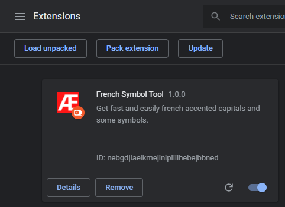
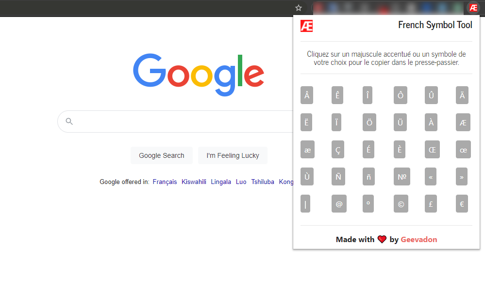
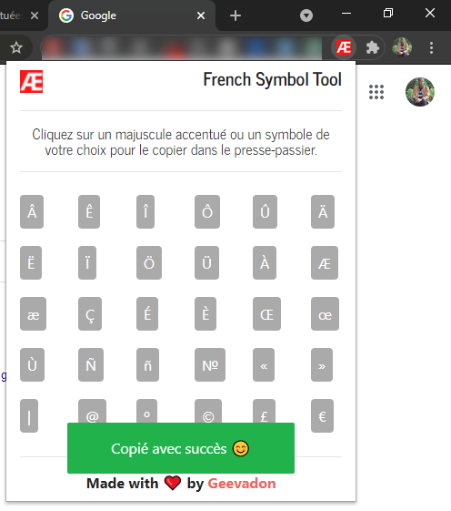

# French Symbol Tool

Il s’agit d’une extension Google Chrome qui vous permet de retrouver en un clic les lettres majuscules accentuées et les symboles que vous utilisez quasiment tous les jours mais qui ne sont pas facilement trouvables sur un clavier d’ordinateur (surtout un ordinateur portable).

Voici une extension qui vous sauve carrément la vie. Elle vous permet de trouver en un clic les lettres majuscules accentuées et aussi les symboles rares (mais que vous utilisez souvent) qui sont difficilement trouvables sur votre clavier, voire pas du tout.

Souvent lorsque nous rédigeons un article de blog via Google Docs par exemple ou lorsque nous communiquons avec nos proches sur les réseaux via le navigateur Google Chrome, nous galérons pour trouver certaines lettres majuscules accentuées ou certains symboles.

Parfois nous allons les rechercher sur les moteurs de recherche pour faire un copier/coller et nous perdons ainsi un temps précieux.

French Symbol Tool vient définitivement mettre fin à cette galère et vous facilite drastiquement la vie en vous proposant tout cela le plus efficacement possible.

Tout ce que vous avez à faire, c'est ouvrir le popup de l'extension et de cliquer sur la lettre majuscule accentuée ou le symbole de votre choix et il sera copié dans votre presse-papier automatiquement.

Incroyable n'est-ce pas ? C'est très facile à utiliser et très pratique comme outil. Je vous recommande fortement de l'installer sur votre navigateur et il sera votre ami fidèle de tous les jours. 😊

# Fonctionnalités disponibles

- Les lettres majuscules accentuées et les symboles sont disponibles sur l’interface de l’extension (le popup).
- Pour copier un majuscule accentué ou un symbole, il suffit de cliquer dessus. La copie se fera automatiquement dans le presse-papiers. Vous n’avez donc qu’à aller le coller là vous le souhaitez (dans un document Google Docs par exemple ou dans la messagerie des réseaux sociaux).
- En cas de succès de la copie, un joli message d’alerte s’affiche. En cas d'échec un message d’alerte s’affiche également.
- Le but était de rendre l’extension très facile à prendre en main.

# Comment installer French Symbol Tool ?
Installer cette extension c’est la chose la plus simple qui soit. Je vous présente, ci-dessous, deux manières de l’installer.

## Installation automatique
L’extension est déjà déployée sur le Chrome Web Store. Tout ce que vous avez à faire pour l’installer sur votre navigateur Google Chrome, c’est vous rendre sur la page dédiée à l’extension sur Chrome Web Store et de cliquer sur le bouton « Add to Chrome (Ajouter à Chrome) ». Vous pouvez <a href="#" target="_blank">cliquer directement sur ce lien</a>.

## Installation manuelle
Cette méthode est à utiliser dans le cas où vous ne retrouvez pas l’extension sur le Chrome Web Store ou si vous voulez apporter quelques modifications au projet et tester les choses par vous-mêmes.

Pour ce faire, vous devez soit cloner ce projet avec la commande ``git clone`` ou soit télécharger le ZIP du projet depuis ce repository.

Une fois que vous avez le projet sur votre ordinateur, ouvrez votre navigateur Google Chrome, allez dans menu (les trois petits points verticaux en haut à droite du navigateur), ensuite dans « More tools (Plus d’outils) » et enfin dans « Extensions ». Vous pouvez, à la place, juste taper cette adresse « **chrome://extensions** » dans la barre d’adresses du navigateur.

Maintenant que vous êtes dans le menu dédié aux extensions, activez le mode développeur en cliquant sur la petite serrure « Developer Mode (Mode développeur) » en haut à droite du navigateur.

Il est maintenant temps d’uploader le projet dans Google Chrome. Pour cela, cliquez sur le bouton « **Load unpacked (Charger l’extension non empaquetée)** »

C’est fait. L’extension est chargée et activée sur votre navigateur. Bravo à vous !

# Contribuer au projet
Si vous êtes développeur (ou pas), vous pouvez tout à fait continuer au projet en signalant des issues ou en proposant des pull requests. Vous pouvez aussi me contacter par mail via <a href="mailto:geevadon.dev@gmail.com">geevadon.dev@gmail.com<a/>

# Version
- 1.0.0

# Auteur & Contributeurs
- Donatien Vamuleke (aka Geevadon)

# Licence
- Ce projet est protégé par la licence MIT.

# Screenshots

